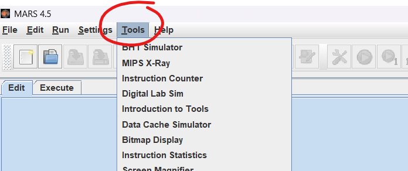
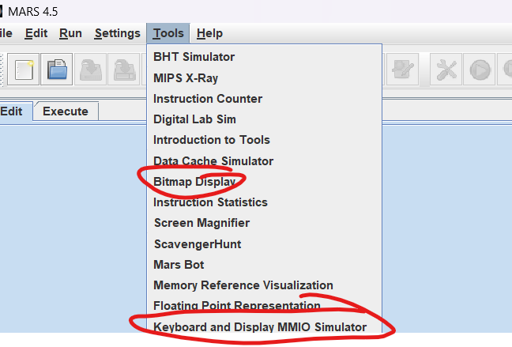
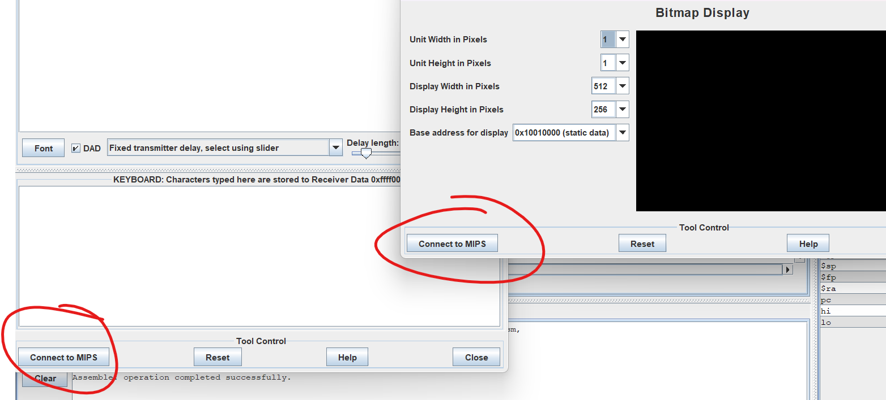
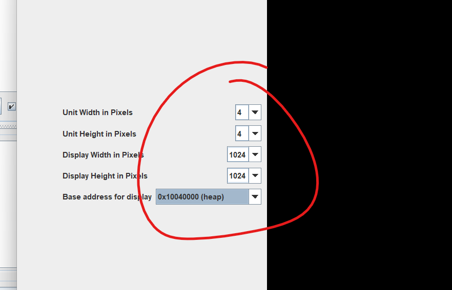
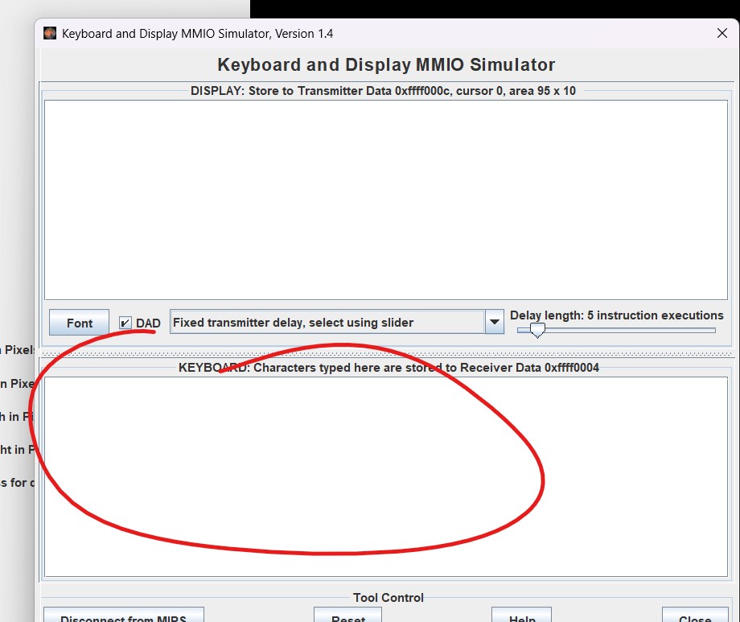

# MIPS Multiplication Game

## TODOS

- [ ] Opponent moves (random selection)
- [ ] Checking for win condition
- [ ] Invalid move warning (if multiple was already picked)
- [ ] "You Win", "You Lose", "Your move", "Opponent move" text

## How to Run

1. Install patched version of MARS. MARS has a known deadlock bug with the keyboard and display simulator. See [here](https://dtconfect.wordpress.com/2013/02/09/mars-mips-simulator-lockup-hackfix/) for more info.

2. Open ALL the `*.asm` files in MARS.

3. Click `Tools` tab on the top right as seen below:

4. Open the Bitmap Display AND Keyboard Simulator. See below:

5. On both the Bitmap Display AND Keyboard Simulator, click `Connect to MIPS` on the bottom right:

6. Configure your Bitmap Display **exactly** as shown in the screenshot. You will need to expand the window size:

8. Compile your program as you normally do. **Make sure you are on the `main.asm` file.** Otherwise, you will get odd behaviors.

## How to Play

1. Click on the simulated keyboard region as shown below:

2. The keys are as follows:

l = move selected pointer right

h = move selected pointer left

k = select top pointer

j = select bottom pointer

ENTER = select number
